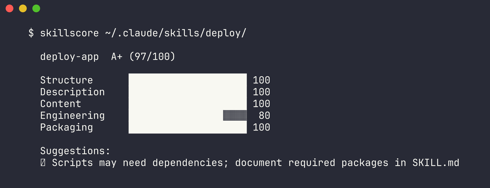

# SkillScore

Quality scorer for Claude Code skills. Grades skills against Anthropic's official best practices.

**[Browse the Directory](https://jtsilverman.github.io/skillscore)** | **[Install the CLI](#install)**

## The Problem

There are 60,000+ Claude Code skills on GitHub. They're sorted by stars. Stars measure popularity, not quality. A skill with 10,000 stars might have vague descriptions, no examples, and broken scripts. A skill with 50 stars might follow every best practice perfectly.

SkillScore turns Anthropic's qualitative [authoring checklist](https://platform.claude.com/docs/en/agents-and-tools/agent-skills/best-practices) into a quantitative scoring algorithm. Point it at any skill and get an actionable quality grade.

The **[web directory](https://jtsilverman.github.io/skillscore)** indexes **3,000+ skills** from 10 curated sources, scored and searchable. Want your skill in the directory? [Submit it](https://github.com/jtsilverman/skillscore/issues/new?template=submit-skill.yml).

## Demo



```
$ skillscore ~/.claude/skills/deploy/

  deploy-app  A+ (97/100)

  Structure      ████████████████████ 100
  Description    ████████████████████ 100
  Content        ████████████████████ 100
  Engineering    ████████████████░░░░  80
  Packaging      ████████████████████ 100

  Suggestions:
  ◐ Scripts may need dependencies; document required packages in SKILL.md
```

## Install

```bash
go install github.com/jtsilverman/skillscore/cmd/skillscore@latest
```

Or download a binary from [Releases](https://github.com/jtsilverman/skillscore/releases).

## Usage

```bash
# Score a local skill
skillscore ./my-skill/

# Score a GitHub skill
skillscore github anthropics/skills/skills/skill-creator

# Score all your installed skills
skillscore scan ~/.claude/skills/

# JSON output for automation
skillscore --json ./my-skill/

# Just the grade
skillscore --quiet ./my-skill/

# All individual checks
skillscore --verbose ./my-skill/

# Build the scored directory index
skillscore index --output web/scored-index.json

# Include local skills in the index
skillscore index --local ~/.claude/skills/ --local-label "My Skills" --output web/scored-index.json
```

## Scoring

Five dimensions, weighted by importance to Claude's skill discovery and execution:

| Dimension | Weight | What it checks |
|-----------|--------|---------------|
| **Structure** | 25% | Valid frontmatter, name format (lowercase, hyphens, no reserved words), description present |
| **Description** | 25% | Action verbs, trigger context ("Use when..."), third-person voice, specificity, length |
| **Content** | 25% | Under 500 lines, code examples, workflow steps, heading structure, reference depth |
| **Engineering** | 15% | Error handling in scripts, documented constants, dependency listing, execution intent |
| **Packaging** | 10% | Directory size, descriptive file names, organization, no junk files, linked references |

Grades: A+ (97+), A (93-96), A- (90-92), B+ (87-89), B (83-86), B- (80-82), C+ (77-79), C (73-76), C- (70-72), D range (60-69), F (<60)

## How it works

SkillScore parses the SKILL.md frontmatter (YAML) and body (markdown AST via goldmark), then runs 21+ checks derived from Anthropic's [skill authoring best practices](https://platform.claude.com/docs/en/agents-and-tools/agent-skills/best-practices). Each check is pass/fail with a weight. Dimension scores are weighted sums normalized to 0-100, then combined into an overall grade.

The checks are calibrated so Anthropic's own official skills score in the A range, while deliberately poor skills (vague descriptions, no examples, uppercase names, backslash paths) score D/F.

## The Hard Part

The quality scoring algorithm. Anthropic's best practices are qualitative ("be specific", "use third person"). Turning those into pass/fail checks that produce useful grades required:

- NLP-adjacent heuristics for description quality (verb detection from a curated 50+ word list, vague term flagging, first/second person detection via regex)
- Markdown AST traversal to detect structural patterns (ordered lists as workflow steps, code blocks as examples, link depth for progressive disclosure)
- Weight calibration against known-good (Anthropic official) and known-bad (test) skills to ensure grades match human intuition
- Handling the "no scripts" case (engineering dimension gives full marks when not applicable, so code-free skills aren't penalized)

## Tech Stack

- **Go 1.24** (stdlib-heavy, minimal dependencies)
- **goldmark** for markdown AST parsing
- **lipgloss** for terminal styling
- **gopkg.in/yaml.v3** for frontmatter parsing
- **Vanilla HTML/JS/CSS** for the web directory (no build step)
- **GitHub Actions** for daily reindexing and Pages deployment

## License

MIT
